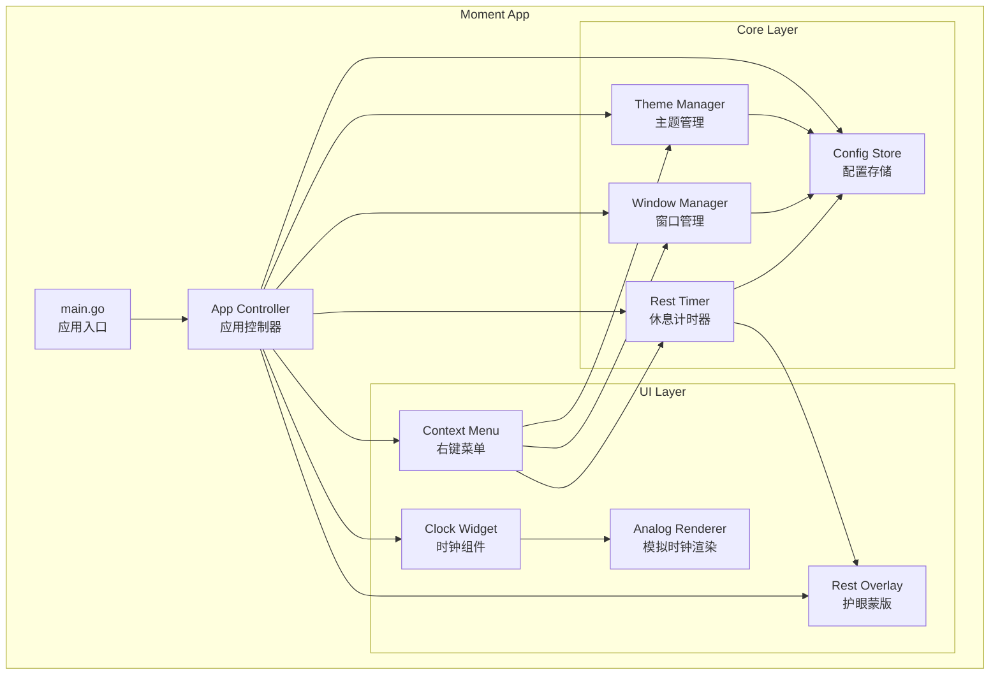

# Design Document: 此刻 (Moment)

## Overview

此刻 (Moment) 是一款基于 Go + Fyne GUI 框架的跨平台桌面悬浮时钟工具。应用以无边框悬浮窗口形式显示时间，支持数字时间、模拟时钟和时间戳三种显示模式，并提供定时护眼休息提醒功能。

技术选型：
- **GUI 框架**: [Fyne v2](https://fyne.io/) — Go 原生跨平台 GUI 工具包，支持 OpenGL 渲染，提供无边框窗口（Splash Window）、自定义主题、系统托盘集成
- **配置管理**: JSON 文件存储，使用 `encoding/json` 标准库
- **系统交互**: Fyne 内置的系统托盘支持 + 平台特定代码处理窗口层级
- **构建**: Go modules，支持 `GOOS=windows` 和 `GOOS=darwin` 交叉编译

## Architecture



应用采用分层架构：
- **UI Layer**: 负责所有可视化组件的渲染和用户交互
- **Core Layer**: 负责业务逻辑、状态管理和数据持久化
- **App Controller**: 协调各组件之间的通信

## Components and Interfaces

### 1. App Controller (`app.go`)

应用的核心控制器，负责初始化和协调所有组件。

```go
type MomentApp struct {
    fyneApp    fyne.App
    mainWindow fyne.Window
    clock      *ClockWidget
    menu       *ContextMenu
    overlay    *RestOverlay
    theme      *ThemeManager
    windowMgr  *WindowManager
    restTimer  *RestTimer
    config     *ConfigStore
}

func NewMomentApp() *MomentApp
func (m *MomentApp) Run()
func (m *MomentApp) Quit()
```

### 2. Clock Widget (`ui/clock.go`)

悬浮时钟组件，支持三种显示模式。

```go
type DisplayMode int

const (
    ModeDigital   DisplayMode = iota  // 数字时间 "15:04:05"
    ModeAnalog                         // 模拟时钟（圆形表盘）
    ModeTimestamp                      // Unix 时间戳
)

type ClockWidget struct {
    widget.BaseWidget
    mode       DisplayMode
    currentTime time.Time
    ticker     *time.Ticker
}

func NewClockWidget(mode DisplayMode) *ClockWidget
func (c *ClockWidget) SetMode(mode DisplayMode)
func (c *ClockWidget) CreateRenderer() fyne.WidgetRenderer
```

### 3. Analog Clock Renderer (`ui/analog.go`)

模拟时钟的自定义渲染器，使用 Fyne Canvas 绘制表盘、时针、分针、秒针。

```go
type AnalogClockRenderer struct {
    clock    *ClockWidget
    face     *canvas.Circle
    hourHand *canvas.Line
    minHand  *canvas.Line
    secHand  *canvas.Line
    markers  []*canvas.Line
}

func (r *AnalogClockRenderer) Layout(size fyne.Size)
func (r *AnalogClockRenderer) Refresh()
```

### 4. Context Menu (`ui/menu.go`)

右键菜单，提供所有设置入口。

```go
type ContextMenu struct {
    menu *fyne.Menu
    app  *MomentApp
}

func NewContextMenu(app *MomentApp) *ContextMenu
func (c *ContextMenu) Build() *fyne.Menu
```

菜单结构：
- 显示模式 → 数字时间 / 模拟时钟 / 时间戳
- 主题 → 浅色 / 深色 / 跟随系统
- 窗口层级 → 置顶 / 普通
- 锁定位置 / 解锁位置
- 休息提醒 → 开启/关闭、间隔设置、透明度设置
- 退出

### 5. Theme Manager (`core/theme.go`)

主题管理器，处理亮色/暗色/跟随系统主题切换。

```go
type ThemeMode int

const (
    ThemeLight  ThemeMode = iota
    ThemeDark
    ThemeSystem
)

type ThemeManager struct {
    mode       ThemeMode
    fyneApp    fyne.App
    onChange   func(ThemeMode)
    stopWatch  chan struct{}
}

func NewThemeManager(app fyne.App) *ThemeManager
func (t *ThemeManager) SetMode(mode ThemeMode)
func (t *ThemeManager) GetMode() ThemeMode
func (t *ThemeManager) CurrentTheme() fyne.Theme
func (t *ThemeManager) startSystemWatch()
```

自定义 Fyne Theme 实现：

```go
type MomentTheme struct {
    dark bool
}

func (m *MomentTheme) Color(name fyne.ThemeColorName, variant fyne.ThemeVariant) color.Color
func (m *MomentTheme) Font(style fyne.TextStyle) fyne.Resource
func (m *MomentTheme) Icon(name fyne.ThemeIconName) fyne.Resource
func (m *MomentTheme) Size(name fyne.ThemeSizeName) float32
```

### 6. Window Manager (`core/window.go`)

窗口管理器，处理窗口层级和位置锁定。

```go
type WindowLevel int

const (
    LevelTopMost WindowLevel = iota
    LevelNormal
)

type WindowManager struct {
    window   fyne.Window
    level    WindowLevel
    locked   bool
    position fyne.Position
}

func NewWindowManager(window fyne.Window) *WindowManager
func (w *WindowManager) SetLevel(level WindowLevel)
func (w *WindowManager) SetLocked(locked bool)
func (w *WindowManager) GetPosition() fyne.Position
func (w *WindowManager) applyLevel()
```

窗口层级通过平台特定代码实现：
- Windows: 使用 `user32.dll` 的 `SetWindowPos` 设置 `HWND_TOPMOST`
- macOS: 使用 CGO 调用 `NSWindow.setLevel`

### 7. Rest Timer (`core/rest.go`)

休息提醒计时器，管理定时触发和蒙版显示逻辑。

```go
type RestTimer struct {
    interval    time.Duration  // 默认 45 分钟
    displayTime time.Duration  // 默认 5 分钟
    maxOpacity  float64        // 最大不透明度 0.0-1.0
    enabled     bool
    timer       *time.Timer
    overlay     *RestOverlay
    onTrigger   func()
}

func NewRestTimer(overlay *RestOverlay) *RestTimer
func (r *RestTimer) SetInterval(d time.Duration)
func (r *RestTimer) SetMaxOpacity(opacity float64)
func (r *RestTimer) Start()
func (r *RestTimer) Stop()
func (r *RestTimer) Reset()
```

### 8. Rest Overlay (`ui/overlay.go`)

全屏绿色蒙版层，支持渐入渐出动画。

```go
type RestOverlay struct {
    window     fyne.Window
    maxOpacity float64
    fadeInDur  time.Duration   // 渐入时长，默认 3 秒
    fadeOutDur time.Duration   // 渐出时长，默认 2 秒
    active     bool
    onDismiss  func()
}

func NewRestOverlay(app fyne.App) *RestOverlay
func (o *RestOverlay) Show(maxOpacity float64)
func (o *RestOverlay) Dismiss()
func (o *RestOverlay) IsActive() bool
```

蒙版实现方式：创建一个全屏无边框窗口，背景为绿色，通过定时器逐步调整窗口透明度实现渐入效果。监听鼠标移动和键盘事件触发渐出消失。

### 9. Config Store (`core/config.go`)

配置持久化，使用 JSON 文件存储。

```go
type Config struct {
    DisplayMode  DisplayMode   `json:"display_mode"`
    ThemeMode    ThemeMode     `json:"theme_mode"`
    WindowLevel  WindowLevel   `json:"window_level"`
    PositionX    float32       `json:"position_x"`
    PositionY    float32       `json:"position_y"`
    Locked       bool          `json:"locked"`
    RestEnabled  bool          `json:"rest_enabled"`
    RestInterval int           `json:"rest_interval_minutes"`
    RestOpacity  float64       `json:"rest_opacity"`
}

type ConfigStore struct {
    config   Config
    filePath string
    mu       sync.RWMutex
}

func NewConfigStore() *ConfigStore
func (c *ConfigStore) Load() error
func (c *ConfigStore) Save() error
func (c *ConfigStore) Get() Config
func (c *ConfigStore) Update(fn func(*Config))
func DefaultConfig() Config
```

默认配置：
```json
{
    "display_mode": 0,
    "theme_mode": 2,
    "window_level": 0,
    "position_x": 100,
    "position_y": 100,
    "locked": false,
    "rest_enabled": true,
    "rest_interval_minutes": 45,
    "rest_opacity": 0.7
}
```

配置文件路径：
- Windows: `%APPDATA%/Moment/config.json`
- macOS: `~/Library/Application Support/Moment/config.json`

## Data Models

### Config 数据模型

| 字段 | 类型 | 默认值 | 说明 |
|------|------|--------|------|
| display_mode | int | 0 (Digital) | 显示模式：0=数字, 1=模拟, 2=时间戳 |
| theme_mode | int | 2 (System) | 主题：0=浅色, 1=深色, 2=跟随系统 |
| window_level | int | 0 (TopMost) | 层级：0=置顶, 1=普通 |
| position_x | float32 | 100 | 窗口 X 坐标 |
| position_y | float32 | 100 | 窗口 Y 坐标 |
| locked | bool | false | 位置是否锁定 |
| rest_enabled | bool | true | 休息提醒是否开启 |
| rest_interval_minutes | int | 45 | 休息间隔（分钟） |
| rest_opacity | float64 | 0.7 | 蒙版最大不透明度 |

### DisplayMode 枚举

| 值 | 名称 | 显示格式 |
|----|------|----------|
| 0 | ModeDigital | "15:04:05" |
| 1 | ModeAnalog | 圆形表盘 + 时/分/秒针 |
| 2 | ModeTimestamp | "1711036800" |

### ThemeMode 枚举

| 值 | 名称 | 行为 |
|----|------|------|
| 0 | ThemeLight | 浅色背景 + 深色文字 |
| 1 | ThemeDark | 深色背景 + 浅色文字 |
| 2 | ThemeSystem | 检测系统主题并跟随 |


## Correctness Properties

*A property is a characteristic or behavior that should hold true across all valid executions of a system — essentially, a formal statement about what the system should do. Properties serve as the bridge between human-readable specifications and machine-verifiable correctness guarantees.*

以下属性基于需求文档中的验收标准推导而来，每个属性都是可通过 property-based testing 验证的通用规则。

### Property 1: Display mode state consistency

*For any* valid DisplayMode value (Digital, Analog, Timestamp), setting the ClockWidget's mode and then querying it should return the same mode that was set.

**Validates: Requirements 1.2**

### Property 2: Theme mode state consistency

*For any* ThemeMode value (Light, Dark, System), setting the ThemeManager's mode should result in the manager reporting that same mode, and the produced theme colors should match the expected scheme (light colors for Light, dark colors for Dark).

**Validates: Requirements 3.1, 3.2**

### Property 3: Lock state consistency

*For any* boolean lock state, setting the WindowManager's locked property and then querying it should return the same value. When locked is true, drag operations should be rejected; when false, drag operations should be accepted.

**Validates: Requirements 5.1, 5.2**

### Property 4: Position persistence while unlocked

*For any* valid position (x, y) where both coordinates are non-negative, updating the window position while unlocked and then saving should persist that position in the config. Loading the config should return the same position.

**Validates: Requirements 5.3**

### Property 5: Rest timer triggers at configured interval

*For any* valid rest interval (positive duration), configuring the RestTimer with that interval should result in the timer being set to fire after exactly that duration.

**Validates: Requirements 6.1, 6.5**

### Property 6: Timer reset after overlay dismiss

*For any* RestTimer state where the overlay has been triggered and then dismissed, the timer should be reset and running with the same interval as before.

**Validates: Requirements 6.4**

### Property 7: Rest settings applied immediately

*For any* valid rest configuration (interval > 0, opacity in [0.0, 1.0]), updating the RestTimer's interval or the RestOverlay's max opacity should immediately reflect the new values when queried.

**Validates: Requirements 6.5, 6.6**

### Property 8: Config serialization round-trip

*For any* valid Config struct, serializing it to JSON and then deserializing should produce an equivalent Config struct.

**Validates: Requirements 8.1, 8.2**

### Property 9: Corrupted config falls back to defaults

*For any* invalid JSON string (including empty string, malformed JSON, and JSON with wrong types), attempting to load it as a Config should result in the default configuration being returned.

**Validates: Requirements 8.3**

## Error Handling

| 场景 | 处理方式 |
|------|----------|
| 配置文件不存在 | 使用默认配置，创建新配置文件 |
| 配置文件 JSON 格式错误 | 使用默认配置，覆盖写入新配置文件 |
| 配置值超出有效范围 | 使用该字段的默认值 |
| 窗口位置超出屏幕范围 | 重置到默认位置 (100, 100) |
| 系统主题检测失败 | 回退到浅色主题 |
| 全屏蒙版窗口创建失败 | 记录日志，跳过本次提醒，重置计时器 |
| 平台 API 调用失败（窗口置顶） | 记录日志，保持当前层级不变 |

## Testing Strategy

### 测试框架

- **单元测试**: Go 标准库 `testing`
- **Property-Based Testing**: [`gopter`](https://github.com/leanovate/gopter) — Go 语言成熟的 PBT 库，支持自定义生成器和 shrinking
- **每个 property test 最少运行 100 次迭代**

### 测试分层

**Property-Based Tests（属性测试）**:
验证通用正确性属性，覆盖大量随机输入：
- Config 序列化/反序列化 round-trip (Property 8)
- Config 错误处理与默认值回退 (Property 9)
- DisplayMode 状态一致性 (Property 1)
- ThemeMode 状态一致性 (Property 2)
- Lock 状态一致性 (Property 3)
- Position 持久化 (Property 4)
- Rest 设置即时生效 (Property 5, 6, 7)

**Unit Tests（单元测试）**:
验证具体示例和边界情况：
- 默认配置值正确性
- 各 DisplayMode 的格式化输出
- 模拟时钟指针角度计算
- 菜单项完整性
- 配置文件路径在不同平台的正确性

**每个 property test 必须标注对应的设计属性编号**:
- 格式: `// Feature: moment-desktop-clock, Property N: [property title]`

### 测试文件组织

```
core/
  config_test.go       — Config round-trip property tests + unit tests
  theme_test.go        — Theme mode property tests + unit tests
  window_test.go       — Window lock/position property tests
  rest_test.go         — Rest timer property tests + unit tests
ui/
  clock_test.go        — Display mode property tests + format unit tests
```
